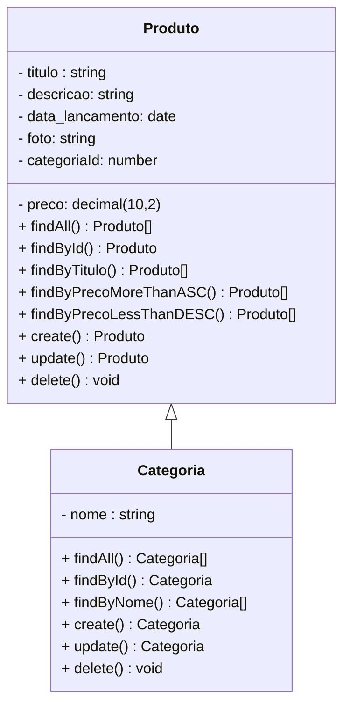
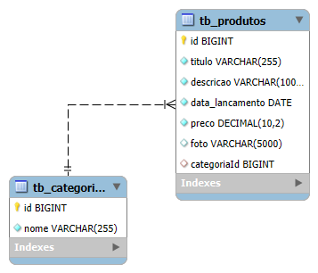

# Nome do Projeto - Backend

 

    

  

## 1. Descrição

Esse projeto consiste no desenvolvimento de uma aplicação para a gestão de produtos e categorias de uma loja de jogos, utilizando tecnologias modernas e robustas. Ele permite o cadastro, consulta, atualização e exclusão de informações sobre os jogos e sua categoria, facilitando a organização e acessibilidade dos dados.

---

## 2. Sobre esta API

A API de gerencimento de jogos e categorias, permite que a loja busquem, cadastrem, atualizem e excluam jogos e categorias.

### 2.1. Principais Funcionalidades

1. Cadastro de Jogos e Categorias: Inserção de dados essenciais sobre os jogos e categorias através do método HTTP: POST.
2. Consulta: Visualização dos jogos e categorias cadastrados por meio de endpoints específicos com HTTP: GET para consultas por id, nome, título ou a visualização geral de todos os contratados.
3. Atualização: Modificação de registros existentes no cadatro do jogo e categoria por meio do HTTP: PUT.
4. Exclusão: Remoção de jogos e categorias do banco de dados através do ID pelo método HTTP: DELETE.

---

## 3. Diagrama de Classes

---

## 4. Diagrama Entidade-Relacionamento (DER)

Adicione a imagem do Diagrama

    

---

## 5. Tecnologias utilizadas

| Item                          | Descrição  |
| ----------------------------- | ---------- |
| **Servidor**                  | Node JS    |
| **Linguagem de programação**  | TypeScript |
| **Framework**                 | Nest JS    |
| **ORM**                       | TypeORM    |
| **Banco de dados Relacional** | MySQL      |

---

## 6. Configuração e Execução

1. Clone o repositório
2. Com Docker instaldo: `docker-compose up -d`
3. Instale as dependências: `npm install`
4. Projeto já está rodando em: `http://localhost:4000`
